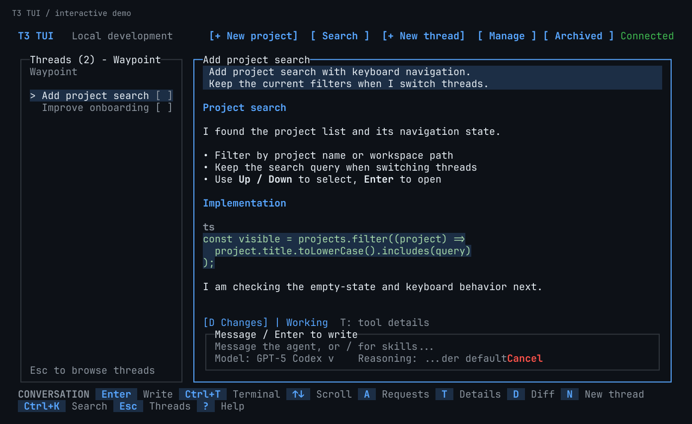
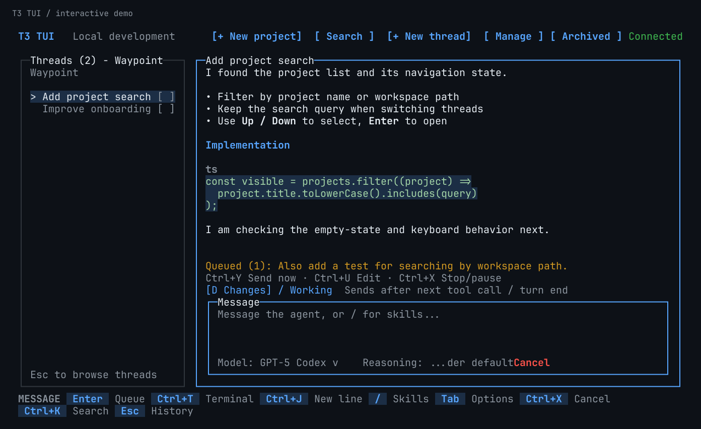
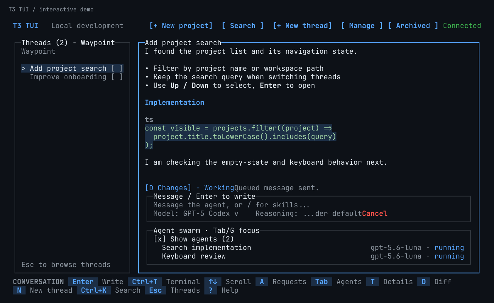
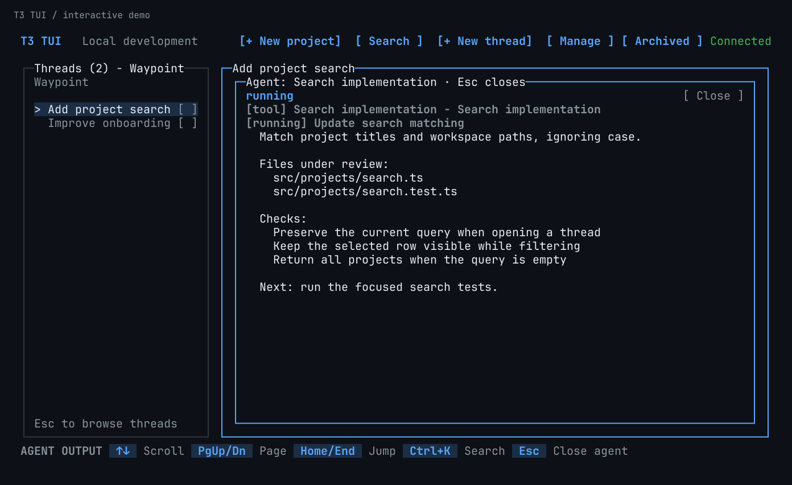
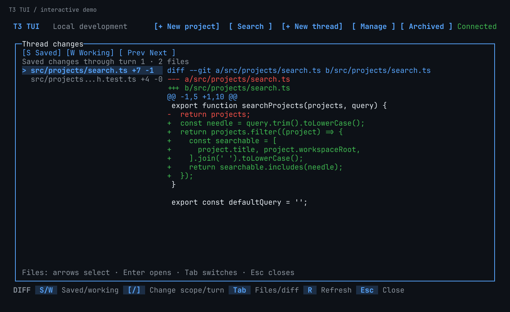
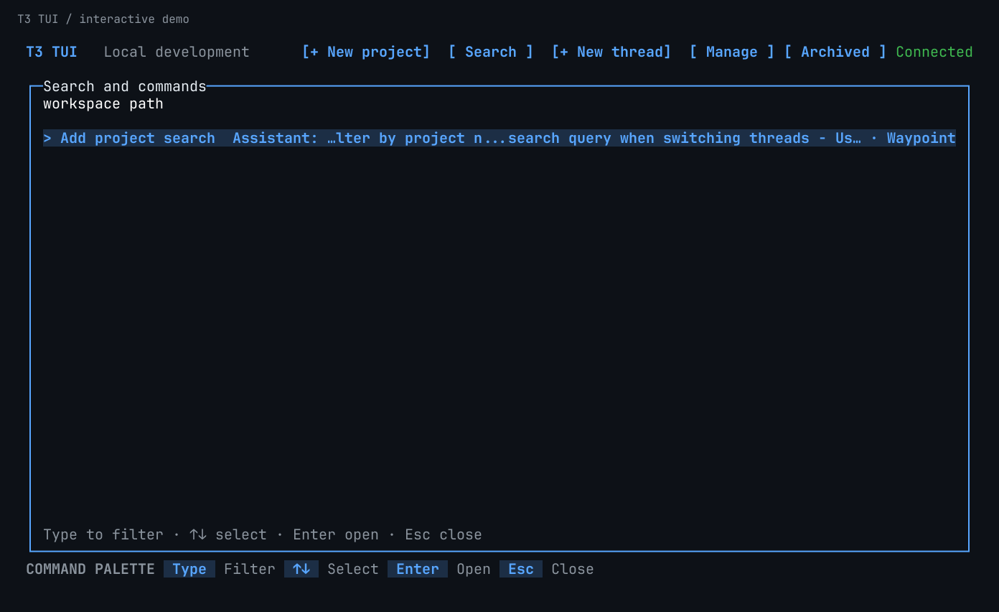
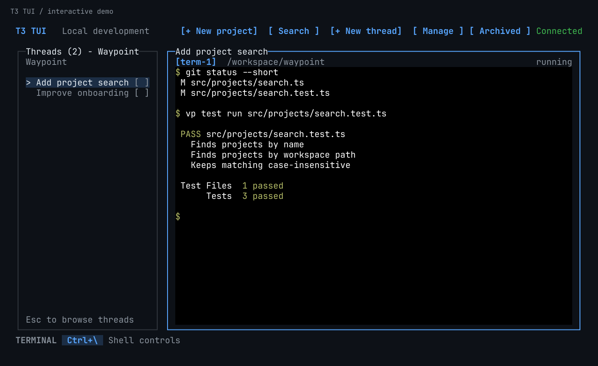
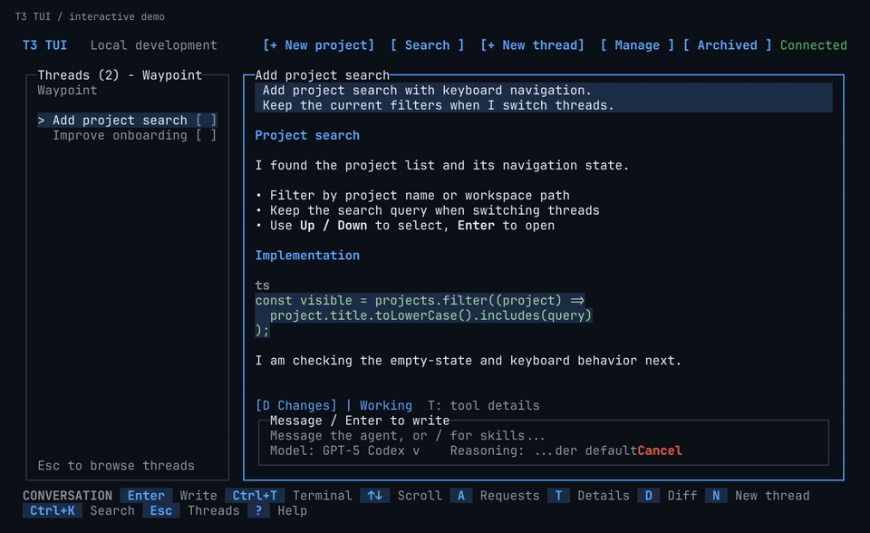
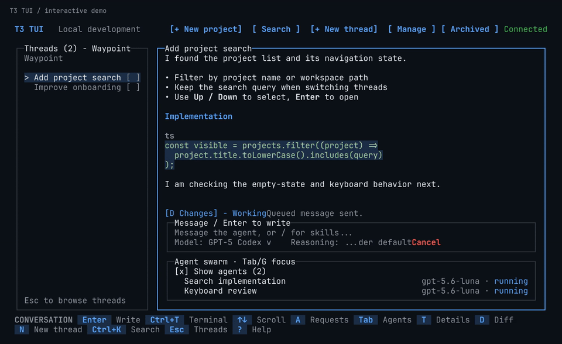

# T3 Code TUI fork

> [!IMPORTANT]
> This repository is an experimental, unaffiliated TUI-focused fork of
> [T3 Code](https://github.com/pingdotgg/t3code). The working name and assets are temporary.
> Use the upstream repository for official T3 Code releases and support. See the
> [TUI client boundary](./docs/internals/tui-client.md) for the fork's scope.

This branch connects to an existing T3 environment to browse projects and threads, send text
prompts, follow agent output, stop turns, respond to approvals and questions, choose models/options,
and invoke provider skills. New threads can use the current checkout or an isolated Git worktree.
It also includes conversation search, Markdown output, saved/per-turn/working-tree diff review,
and an embedded terminal. Switching provider accounts in existing threads and Git write actions
remain unfinished. Cross-platform certification remains a release requirement.

## See it in action

Real TUI renders with synthetic demo conversations, tool output, and agent activity—no private
workspace data or credentials. The walkthroughs are scripted examples, not live agent sessions.



<details>
<summary>Screenshot gallery: queued messages, agents, diffs, search, and terminal</summary>

Queue a follow-up while the agent works. It sends after a tool completes or the turn ends.



See the agent list, then open an agent's output without leaving the conversation.





Review saved changes by file; switch to working-tree or individual-turn changes with the hotkeys.



Find a thread by its conversation text with `Ctrl+K`.



Open the project's terminal with `Ctrl+T`. `Ctrl+\` releases keyboard focus to the shell controls.



</details>

<details>
<summary>Watch: queue a follow-up message (10 seconds)</summary>



[Download the MP4 walkthrough](./docs/media/tui/queue-walkthrough.mp4).

</details>

<details>
<summary>Watch: agents, diff review, and terminal (13 seconds)</summary>



[Download the MP4 walkthrough](./docs/media/tui/review-walkthrough.mp4).

</details>

## Getting started with T3 TUI

### 1. Install and launch T3 Code first

T3 TUI connects to a running T3 Code environment. Install the desktop app using the
[installation instructions below](#installation), then launch it. Set up and authenticate at
least one provider in T3 Code before sending prompts from the TUI.

Alternatively, with Node.js and npm installed, start the T3 Code server and web app in a terminal:

```bash
npx t3@latest
```

Keep the desktop app or server running while using the TUI. The TUI shares its projects, threads,
and agents; it does not copy the database or start a second server against that data.

### 2. Prepare this TUI checkout

The commands below use Bash on macOS or Linux. Clone this fork and install its dependencies
with [Vite+](#install-vp):

```bash
git clone https://github.com/StevenMatchett/t3code.git
cd t3code
vp i
```

If you already have the checkout, run `vp i` from its root. The `start-tui.sh` launcher compiles
the TUI and uses `npx` to run Node 26.4.0, including the required FFI support. Its first run may
download that Node version.

### 3. Generate a pairing key from the running T3 Code environment

On the machine running T3 Code, open another terminal and run this **outside a development
checkout**, so the command discovers your installed environment rather than a worktree's dev server:

```bash
npx t3@latest pair --label "T3 TUI"
```

This prints a QR code and a **Pairing URL** containing a one-time token (the pairing key).
Copy the complete URL. The default expiry is five minutes; generate another if it expires or
has already been used. Do not open the link in a browser before pairing the TUI.

For a server using a custom T3 home, supply the same base directory:

```bash
npx t3@latest pair --base-dir /absolute/path/to/t3-home --label "T3 TUI"
```

You can also create a pairing link in **T3 Code → Settings → Connections**. If your installed
version does not recognize the `pair` command, use that screen or update T3 Code.

### 4. Pair once, then start T3 TUI

Return to this checkout's root. Set `T3_ORIGIN` to the HTTP(S) origin in your pairing URL,
including its port, but without `/pair` or the token. For example, if the link starts with
`http://127.0.0.1:3773/pair`, use:

```bash
T3_ORIGIN='http://127.0.0.1:3773'
```

Replace that example with your actual address. For a hosted pairing link, use its embedded
backend address, not `https://app.t3.codes`. When connecting from another machine, use a reachable
network address; see [remote access](./docs/user/remote-access.md).

In Bash, paste the complete pairing URL at the hidden prompt and press Enter:

```bash
read -r -s -p 'Paste the pairing URL, then press Enter: ' T3_PAIRING_URL
printf '\n'
printf '%s\n' "$T3_PAIRING_URL" | ./start-tui.sh --connect "$T3_ORIGIN" --pair-stdin
unset T3_PAIRING_URL
```

Or, on macOS, copy the URL and read it directly from the clipboard:

```bash
pbpaste | ./start-tui.sh --connect "$T3_ORIGIN" --pair-stdin
```

Pairing saves the connection and exits. Now launch the TUI:

```bash
./start-tui.sh
```

On subsequent launches, run `./start-tui.sh` again with T3 Code running. You only need a new
pairing link if the saved connection is no longer authorized. Closing the TUI leaves T3 Code
and its agents running.

### Connection details

Pairing saves a derived bearer credential under `~/.t3-tui`, then exits. macOS and Linux use a
mode-`0600` file. The Windows implementation encrypts the credential with current-user DPAPI through
Windows PowerShell, without putting the token in arguments or environment variables. Its native
round-trip test still needs a Windows runner. Protection failures never fall back to plaintext.
The next launch validates the credential and environment identity before opening the prototype shell.
Do not put pairing tokens in command arguments. The parser accepts T3's direct and hosted links,
including tokens in the fragment or query string. For a hosted link, `--connect` must match the
embedded backend address, not the hosted page. The TUI contacts only the selected backend.
The scheme, hostname, and port must match; `localhost` and `127.0.0.1` are different origins.

`--connect <origin>` checks the saved connection's origin. Missing, expired, or rejected credentials
require pairing again, never an automatic replacement server. Quitting the TUI leaves an existing
T3 server running. The project list, active threads, and conversation history come from that same
server and update when another client changes them.

Use Up/Down or Tab to select a project or thread, Enter or Right to open it, and Escape or Left to
go back. Within a conversation, Up/Down and Page Up/Down scroll; End follows the latest output.
The mouse wheel scrolls conversation history, and project or thread rows can be opened with a
click. Typing in the composer returns history to the latest output. Home moves to the top and
requests earlier turns when available. `?` opens help and `R` reconnects. Ctrl+C opens a
confirmation before closing the TUI; closing it does not stop agents on the shared environment.
Wide terminals keep the thread list beside the conversation; smaller terminals use a single pane.
The composer stays visible, with its border indicating when it owns keyboard input. Routine tool
activity is collapsed by default; press `t` from history to expand it. Errors and pending requests
remain visible.

The TUI remembers the selected project and thread, sidebar view, conversation scroll position,
composer focus, tool detail visibility, and terminal tab. Reopening it reconnects to the same
environment and restores that view, including after the TUI process is killed. State is stored
separately for each environment and server origin under `~/.t3-tui/ui-state.sqlite` (or your
`--state-dir`). Each running TUI owns a separate saved session, so concurrent windows do not
overwrite each other's drafts, queues, or view. On startup, the TUI restores the most recently
opened session that is no longer running, or starts fresh if every session is in use.
Confirmation dialogs close on restart.

Start a message with `!` to run a shell command, for example `!git status`. Enter runs it directly
in a fresh terminal in the thread's worktree or project directory and opens the output. Shell
commands bypass the agent and run immediately, even while an agent turn is active.

To edit an earlier prompt, press `e` from conversation history or choose **Edit from checkpoint**
in the command palette. Select the prompt, then choose **Revert and keep changes** to preserve
workspace files or **Revert files too** to restore them. The selected prompt and attachments
return to the composer below any unsent draft. This removes that prompt and later conversation
from active history; stop any running turn and resolve queued messages first. Provider support
for rewind is required.

To start a conversation, select a project and click **New thread**, or press `n` from navigation
or conversation history. Choose a title, provider/model, and **Current checkout** or **New worktree**.
Permissions initially follow the project's/environment's settings. Creating the thread does not
send a prompt or start an agent.

To add a project, click **New project** or press `p`. Choose **Local folder** to browse directories
on the connected environment, including remote environments, or choose **GitHub URL** to clone a
repository there. The clone destination starts from the environment's configured add-project base
directory and remains editable. Private repositories use the GitHub credentials installed on that
environment.

A new worktree uses the base ref's committed files (`HEAD` by default), with a generated branch
and a server-managed location. It does not copy uncommitted changes, fetch remotes, or run setup
scripts automatically. Worktree threads are marked `[WT]` and show their directory when opened.
If creation is not confirmed, Retry reuses the same thread ID and checks for the same worktree.
Close hides the form without cancelling an in-flight server operation. Start over requires
confirmation and retains any created thread, branch, or worktree; it never deletes them.

Use `Ctrl+B` or the sidebar's view toggle to switch between project navigation and recent threads
across all projects. Recent threads are ordered by last update and show their project underneath.
Switching views preserves the open conversation. The same toggle is available in `Ctrl+K` search.
While browsing the sidebar, Left selects projects and Right selects recent threads; Up/Down
selects a row and Enter opens it. Project sublines are indented and dimmed within the terminal's
fixed-size text grid.

In an open conversation, Enter or `i` focuses the composer. Enter sends; Shift+Enter inserts a
newline. Terminals that cannot distinguish Shift+Enter from Enter can use Ctrl+J as a fallback.
In an empty composer, Up recalls previous prompts from this thread, including canceled turns.
Up/Down walks through recalled prompts; Down past the newest returns to an empty composer.
Recall is text-only and never sends automatically. Editing a recalled prompt makes it a normal
draft. For multiline or wrapped prompts, arrows move the cursor until the first or last visual
line. A draft with text or attachments is left untouched.

Escape returns to history without discarding the draft. Text pasted into the composer is never
submitted automatically. Drafts, pasted text, and attachments are saved locally as you edit and restored after a restart. Prompts use the thread's existing model, options, and runtime mode. During
an active turn, Enter queues your message for the next completed tool call or the end of the turn.
The queue above the composer shows what is waiting and when it is sending. Messages leave one at
a time, even if you navigate to another thread. Pending approvals and questions hold delivery.
Ctrl+Y sends the first queued message now; Ctrl+U returns it to an empty composer for editing.
Cancel or Ctrl+X stops the active turn and pauses the queue. Failed sends also pause it; Ctrl+Y
retries without duplicating the command. Queued messages survive restarts and reopen paused; use Ctrl+Y to resume sending.

While browsing a thread, press `O` to open its branch's pull request in your browser, or choose
“Open pull request in browser” from `Ctrl+K`. The lookup uses the thread's repository/worktree
on the connected server. Over SSH or without a desktop, the TUI shows the link instead; `C`
copies it to your terminal's clipboard. Esc closes the PR panel.

Use the model and reasoning dropdowns on the composer to change the shared thread's selection.
Click a control, or Tab from the text editor to it and press Enter. Choose a value to apply it;
Escape closes the dropdown without discarding your prompt. Only options advertised by the current
provider/account are offered. Providers that lock a started conversation require a new thread;
a running turn must finish or be stopped before changing models.

While browsing a thread's output, press `/` to search the loaded, displayed text. Matches are
highlighted as you type; Enter/Down moves to the next match and Shift+Enter/Up moves to the previous
one. Esc closes search and returns to browsing. Expand Details to include tool details in search.

In the message box, type `/` to open the inline skills menu. Continue typing to filter it, then use Up/Down and Enter
or click a result. Selection replaces the slash query and prepares the provider-native invocation
at the start of the draft, preserving surrounding text. It never sends automatically. Escape
leaves the slash text untouched; edit the arguments and press Enter when ready to send. Skills come
from the environment's provider catalog, including workspace-specific entries when the server
reports them. Disabled and agent-only skills are excluded. Older servers, including T3 0.0.35,
only report the provider-level catalog, so project skills may require a server upgrade. Skill
execution remains the provider's responsibility; the TUI does not load local skill files or add
its own tool runtime.

Agent questions appear inside the conversation and take keyboard focus when you are viewing that
thread. Your chat draft is preserved. Use arrows to choose, Space to toggle choices, and Enter to
select Continue or Submit after answering. Custom text is offered only when permitted. Escape
returns to history; click the question to resume. An open terminal keeps focus until you leave it.
Press `a` from history to revisit a question or review pending approvals. Approval choices come
from the provider and require a separate confirmation. Responses
remain pending until the server reports the result, including responses made in another client.
The TUI honors the server's output-streaming preference; some servers buffer text until a turn
finishes or pauses.

For an isolated prototype environment, use `./start-tui.sh --new-environment`. This uses a separate
`standalone` directory under the TUI state directory and does not share existing T3 threads.

## Build an internal artifact

With workspace dependencies installed, build a host-specific prototype outside the checkout:

```bash
npx --yes node@26.4.0 apps/tui/scripts/build-artifact.mjs
```

The command prints a new temporary artifact directory. An optional directory argument must name a
path that does not exist. The artifact contains the TUI, server, required runtime packages, upstream
license and provenance, third-party notices, and SHA-256 file checksums. It contains no web, desktop,
mobile, or marketing bundle. Dependency installation and security settings are unchanged.

Run `node <artifact-directory>/t3-tui.mjs` with Node 26.4 or newer. The launcher enables the required
FFI flag. Existing-environment attachment remains the default; `--new-environment` explicitly starts
the bundled server. `--version` reports the TUI, server, upstream base, and OpenTUI versions.

The TUI package exposes `test:artifact` for relocation, repeat-build checksums, native assets,
standalone startup, shared-server attachment, and terminal cleanup. This is a development artifact,
not a public release or an installer. macOS arm64 has local smoke evidence; Linux and Windows
certification remains outstanding.

## Upstream project

T3 Code is an "agent harness control surface". It enables control of the agents on your machine with a best-in-class mobile app ([iOS](https://apps.apple.com/us/app/t3-code-remote-claude-more/id6787819824), [Android](https://play.google.com/store/apps/details?id=com.t3tools.t3code)), [web app](https://app.t3.codes) and [Electron-based desktop app](https://t3.codes).

Works with your subscriptions on Claude Code, Codex, Cursor, Grok Build, OpenCode, and Google Antigravity. If they're set up on your computer, T3 Code can control them.

## "Wait, what are you selling me?"

Nothing. We built T3 Code because we wanted the best possible development experience with agents. We were inspired by existing solutions like the Codex desktop app, Conductor, Claude Desktop and Cursor Glass, but none met our bar.

We wanted something performant, remote-ready, and truly open. If we ever go the wrong direction, we want you to have everything you need to fork and build the editor that you want.

## Installation

> [!WARNING]
> T3 Code currently supports Codex, Claude, Cursor, Grok Build, OpenCode, and Antigravity. Install and authenticate at least one provider before use:
>
> - Codex: install [Codex CLI](https://developers.openai.com/codex/cli) and run `codex login`
> - Claude: install [Claude Code](https://claude.com/product/claude-code) and run `claude auth login`
> - Cursor: install [Cursor CLI](https://cursor.com/cli) and run `agent login`
> - Grok Build: install [Grok Build CLI](https://x.ai/cli) and run `grok login`
> - OpenCode: install [OpenCode](https://opencode.ai) and run `opencode auth login`
> - Antigravity: enable it in Settings, then use **Install Antigravity** and **Sign in with Google**. No CLI is required.

### Try it out (install-free)

The easiest way to test T3 Code is to run the server in your terminal (requires Node.js 22.16+, 23.11+, or 24.10+):

```bash
npx t3@latest
```

This will launch T3 Code's backend on your machine as well as the local web app to control your agents.

Tip: Use `npx t3@latest --help` for the full CLI reference.

### Desktop app

Install the latest version of the desktop app from [GitHub Releases](https://github.com/pingdotgg/t3code/releases), or from your favorite package registry:

#### Windows (`winget`)

```bash
winget install T3Tools.T3Code
```

#### macOS (Homebrew)

```bash
brew install --cask t3-code
```

#### Arch Linux (AUR)

Stable:

```bash
yay -S t3code-bin
```

Nightly:

```bash
yay -S t3code-nightly-bin
```

The AUR packaging is maintained in this repository under [`packaging/aur`](./packaging/aur).

## Some notes

We are very very early in this project. Expect bugs.

We are (mostly) not accepting contributions yet. Small fixes may be considered. Big features will not be.

## Documentation

Full docs live in [docs/](./docs). There's no docs site yet.

- [Install and first run](./docs/user/install.md)
- [Permission modes](./docs/user/permission-modes.md)
- [Keyboard shortcuts](./docs/user/keybindings.md)
- [Project settings](./docs/user/project-settings.md)
- [Remote access from a phone or another machine](./docs/user/remote-access.md)
- [Keeping app and server in sync](./docs/user/updating.md)
- [Source control integrations](./docs/user/source-control.md)
- Multiple accounts: [Codex](./docs/user/providers-codex.md) · [Claude](./docs/user/providers-claude.md)
- [Run T3 Code as a background service](./docs/user/background-service.md)

Building from source? Start at [docs/internals/overview.md](./docs/internals/overview.md).

## If you REALLY want to contribute still.... read this first

### Install `vp`

T3 Code uses Vite+ so you'll need to install the global `vp` command-line tool.

#### macOS / Linux

```bash
curl -fsSL https://vite.plus | bash
```

#### Windows

```bash
irm https://vite.plus/ps1 | iex
```

Checkout their getting started guide for more information: https://viteplus.dev/guide/

### Install dependencies

```bash
vp i
```

Read [CONTRIBUTING.md](./CONTRIBUTING.md) before reporting a bug or opening a PR.

Have a feature request? Start an [Ideas discussion](https://github.com/pingdotgg/t3code/discussions/categories/ideas).

Need support? Join the [Discord](https://discord.gg/jn4EGJjrvv).
